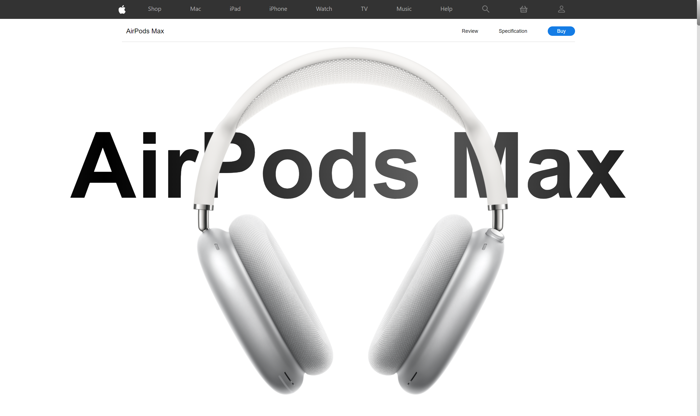
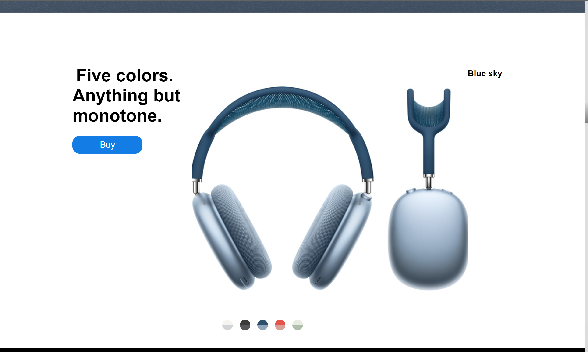
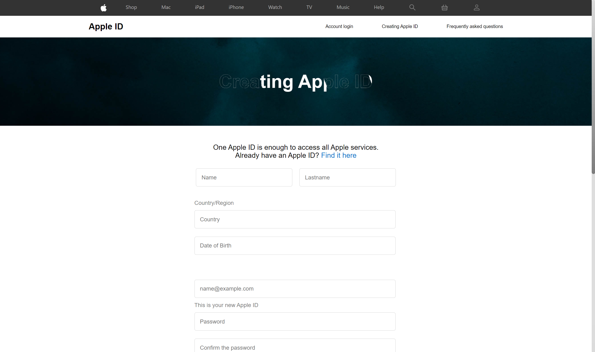
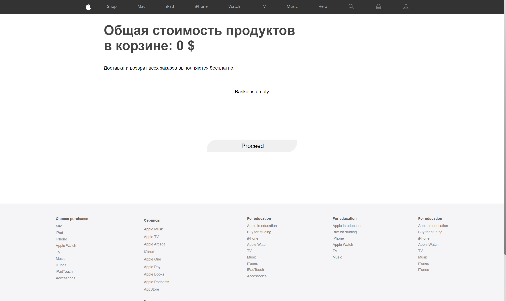
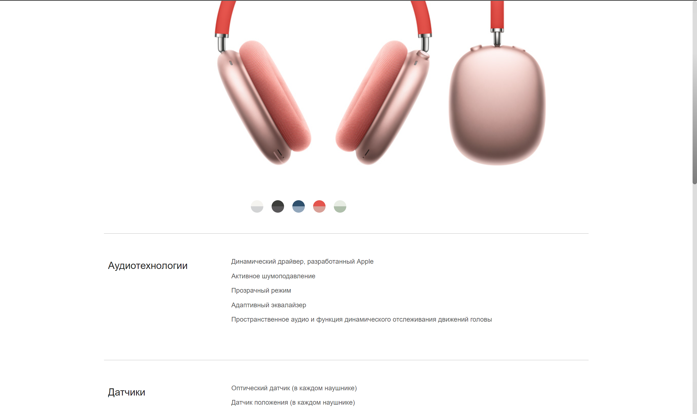

# Getting Started with Apple Site Front

Install and running

1) Open project folder with VSCODE (or WebStorm)

2) Install dependencies

        npm install (yarn install)

3) Test web app

        npm run start

4) Open with browser web app

        http://localhost:3000/

You can reach the site (https://apple-site-air-pods-max.netlify.app)

## Home page

## Description #1

## Colors gallery

## AppleId page creation

## Basket page

## Specification page
